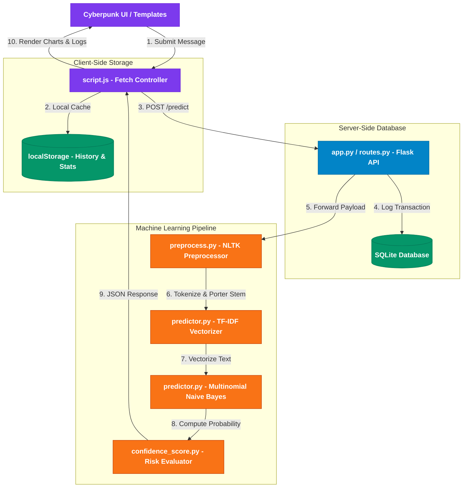

# 🛡️ SpamShield AI — Production-Ready SMS Spam & Phishing Detection Platform

<div align="center">

[](https://sms-spam-detection-p9h6.onrender.com)
[](https://www.python.org/)
[](https://flask.palletsprojects.com/)
[](https://scikit-learn.org/)
[](LICENSE)

**An internship-grade, portfolio-ready cybersecurity web application designed to scan, analyze, and detect SMS spam and phishing vectors in real-time.**

[✨ Explore Live Application](https://sms-spam-detection-p9h6.onrender.com) • [💻 Local Installation](#-local-installation) • [🔌 API Documentation](#-api-reference)

---

</div>

## 🛡️ Project Overview

**SpamShield AI** delivers high-fidelity threat detection results wrapped inside a futuristic glassmorphic cyberpunk interface. Users can input suspicious text messages, witness the real-time classification process, and instantly retrieve deep threat metrics:
*   **Classification Verdicts**: Immediate Spam/Ham decision.
*   **Risk-Level Assessments**: High, Medium, or Low severity.
*   **Prediction Confidence**: Granular probability output.
*   **Suspicious Keyword Analysis**: Highlighted threat vectors.

Under the hood, the application utilizes a mathematically optimized **Multinomial Naive Bayes** classifier trained on historical SMS datasets, processed alongside a **TF-IDF Vectorizer** to represent natural language mathematically based on term distinctiveness and frequency.

---

## ⚡ Key Features

*   🏎️ **Sub-Millisecond Classification**: Rapid inference powered by Scikit-Learn's Multinomial Naive Bayes.
*   🧠 **Advanced NLP Pipeline**: Replicates the exact training preprocessing with NLTK Porter Stemming, tokenization, stopword exclusions, and punctuation filters.
*   💾 **Double-Redundant Analytics**: Records threat intelligence in both client-side browser `localStorage` and a server-side SQLite database.
*   📊 **Threat Intelligence Console**: High-end dashboard tracking threat ratios, displaying dynamic Chart.js visualizations, and logging scan histories in an interactive table.
*   🎨 **Futuristic Cyberpunk UI**: A stunning visual interface featuring:
    *   Glassmorphic components.
    *   Dynamic particle backdrops.
    *   GSAP typewriters & custom typewriter animations.
    *   AOS (Animate on Scroll) reveal animations.
*   🛡️ **Robust Input Validation**: Strict checks to reject empty payloads and oversized messages (capped at 1000 characters).

---

## 🏗️ System Architecture & NLP Pipeline

Below is the end-to-end data flow and processing pipeline, from the client interface down to the machine learning inference engine and storage layers:



---

## 🛠️ Technology Stack

| Layer | Technology | Purpose | Description |
| :--- | :--- | :--- | :--- |
| **Frontend UI** | HTML5, CSS3, Vanilla JS, Tailwind CSS | Core Structure & Styling | Modern layouts featuring futuristic glassmorphism and fully responsive views. |
| **Animations** | GSAP, AOS, Particles.js | Interactive Aesthetics | Custom neon glows, typing indicators, entry transitions, and dynamic canvas backgrounds. |
| **Data Viz** | Chart.js | Interactive Dashboards | Renders threat ratio distributions (Spam vs. Ham) in real-time. |
| **Icons** | Lucide Icons, Font Awesome | Threat Vector Indication | Instant visual cues for risk levels and status alerts. |
| **Backend Engine** | Flask, Flask-CORS | API Routing & Middleware | Python WSGI micro-framework managing routing, model interaction, and CORS policies. |
| **Data Store** | SQLite3 | Server-Side Logging | Lightweight, transaction-safe database engine logging inference operations. |
| **AI/ML Core** | Scikit-Learn, NLTK, Joblib | Classification & NLP | Vectorizes raw input text, processes language patterns, and outputs classification metrics. |
| **Deployment** | Docker, Render | Containerization & Hosting | Unified cloud architecture utilizing standard container images for 100% environment reproducibility. |

---

## 📂 Repository Structure

```text
SpamShield-AI/
├── backend/
│   ├── app.py                # Flask application factory & middleware orchestrator
│   ├── routes.py             # Server endpoints (/health, /predict, /api/history)
│   ├── config.py             # Environment configurations (dev, testing, production)
│   ├── requirements.txt      # Python backend packages & dependencies
│   ├── model/
│   │   ├── model.pkl         # Serialized Multinomial Naive Bayes classifier
│   │   └── vectorizer.pkl    # Serialized TF-IDF text vectorizer
│   ├── utils/
│   │   ├── preprocess.py     # NLTK Pipeline (tokenization, stemming, stopwords)
│   │   ├── predictor.py      # Inference manager & pickle deserializer
│   │   ├── keyword_detector.py # Suspicious keyword lookup logic
│   │   └── confidence_score.py # Risk weight scoring & threat levels
│   └── database/
│       └── db.py             # SQLite helper (schema creation & records INSERT/SELECT)
├── frontend/
│   ├── templates/
│   │   ├── layout.html       # Head templates & CDN loader shell
│   │   ├── index.html        # Interactive scan console & hero screen
│   │   ├── about.html        # NLP pipeline architectural breakdown panel
│   │   └── dashboard.html    # Chart.js analytics & query logs table
│   ├── static/
│   │   ├── css/style.css     # Glowing styling, grid layout & backdrop rules
│   │   └── js/script.js      # Form handler, Chart.js updates & localStorage syncing
│   └── components/
│       ├── navbar.html       # Neon glow sticky navigation bar
│       └── footer.html       # Tech credit footer component
├── dataset/
│   └── spam.csv              # Raw CSV data utilized for classifier training
├── notebooks/
│   └── sms_spam_detection.ipynb # Google Colab research notebook
├── deployment/
│   ├── Dockerfile            # Multi-stage production container instruction
│   ├── Procfile              # Process runner declaration (gunicorn)
│   ├── runtime.txt           # Environment target Python version
│   └── render.yaml           # Declarative blueprint for one-click Render setups
├── tests/
│   ├── test_api.py           # Endpoint integration & schema validation tests
│   ├── test_model.py         # Precision and confusion matrix tests
│   └── test_ui.py            # Static views & DOM elements verification
├── .gitignore                # Version control exclusions
├── LICENSE                   # Open-source MIT license agreement
└── main.py                   # Main bootstrapper script for development execution
```

---

## 🔌 API Reference

### 1. System Health Status

Verify backend service availability.

*   **Endpoint**: `/health`
*   **Method**: `GET`
*   **Headers**: None
*   **Response (200 OK)**:
    ```json
    {
      "status": "ok"
    }
    ```

### 2. Threat Vector Inference

Analyze a text string for spam, phishing, and security vectors.

*   **Endpoint**: `/predict`
*   **Method**: `POST`
*   **Headers**: `Content-Type: application/json`
*   **Payload**:
    ```json
    {
      "message": "Congratulations! You won 50,000 cash prize. Click now to claim your award."
    }
    ```
*   **Response (200 OK)**:
    ```json
    {
      "prediction": "Spam",
      "confidence": 99.4,
      "risk_level": "High",
      "probability": 0.994,
      "keywords": ["congratulations", "win money", "cash prize", "claim reward", "click now"]
    }
    ```

### 3. Retrieve Inference Logs

Fetch the history of executed scans from the server-side SQLite database.

*   **Endpoint**: `/api/history`
*   **Method**: `GET`
*   **Response (200 OK)**:
    ```json
    [
      {
        "id": 1,
        "message": "Congratulations! You won 50,000 cash prize. Click now to claim your award.",
        "prediction": "Spam",
        "confidence": 99.4,
        "risk_level": "High",
        "probability": 0.994,
        "keywords": ["congratulations", "win money", "cash prize", "claim reward", "click now"],
        "created_at": "2026-05-27 12:05:32"
      }
    ]
    ```

---

## 🚀 Local Installation

Deploy SpamShield AI on your local development workstation in three simple steps:

### 1. Clone & Set Up Directory

```bash
git clone https://github.com/samarthupadhyay2294-rgb/SMS-spam-detection.git
cd SMS-spam-detection
```

### 2. Install Dependencies

Ensure Python 3.10+ is configured. Create a virtual environment and run the package installer:

```bash
# Initialize virtual environment
python -m venv venv

# Activate virtual environment
# On Windows PowerShell:
.\venv\Scripts\Activate.ps1
# On macOS / Linux:
source venv/bin/activate

# Install required packages
pip install -r backend/requirements.txt
```

> [!NOTE]
> During first-time environment startup, NLTK stopword bundles are automatically fetched and indexed via python hooks, ensuring a smooth, manual-intervention-free bootstrap.

### 3. Run Development Web Server

```bash
python main.py
```

The system will start up in development mode and expose the web UI at **`http://127.0.0.1:5000`**. Go ahead and open it in your browser!

---

## 📊 Dashboard & Usage Guide

1.  **Scanner Interface**: Open the home screen, insert a message into the scanning terminal, and click **Analyze Vector**. A simulated AI matrix scanner will highlight keywords, compute probabilities, and prompt threat flags.
2.  **Threat Analytics**: Toggle the **Dashboard** in the navbar to explore live metrics. The interface visualizes real-time metrics, system accuracies, and logs recent inputs in an interactive table.
3.  **Local Isolation**: Click **Clear Database** in the dashboard to instantly wipe both the client's `localStorage` and the database server's transaction log.

---

## ☁️ Production Deployment

### Render One-Click Deployment

This repository is optimized for [Render](https://render.com/). It includes a declarative infrastructure blueprint `deployment/render.yaml` that specifies the runtime, environment, and services needed to spin up your application.

1.  Connect your GitHub repository to Render.
2.  Select **Blueprint** from the Render Dashboard.
3.  Confirm creation. Render will build the container using the project's multi-stage Dockerfile and host it globally.

### Manual Docker Container Deployment

If you prefer containerized deployment locally or on a standard cloud VM (e.g., AWS, GCP, Azure):

```bash
# Build the Docker image
docker build -f deployment/Dockerfile -t spamshield-ai .

# Run the container exposing port 5000
docker run -d -p 5000:5000 spamshield-ai
```

---

## 📄 License

This repository is distributed under the terms of the open-source [MIT License](LICENSE). Feel free to use, modify, and distribute this platform as desired.


